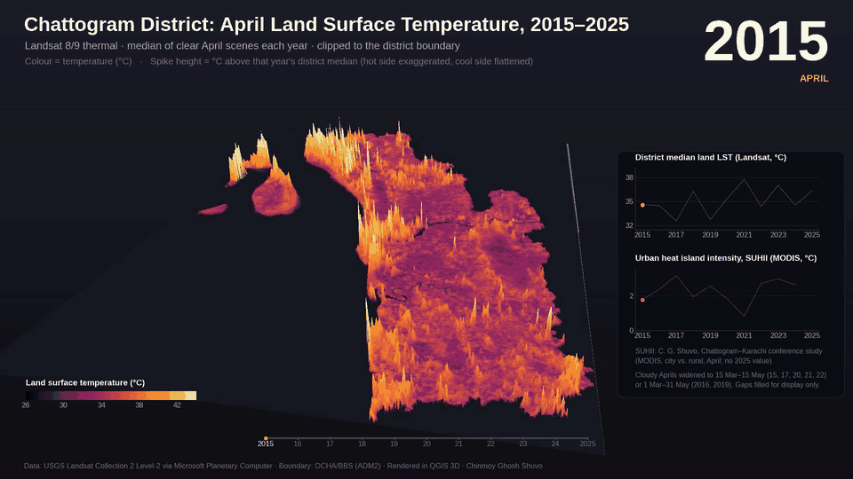
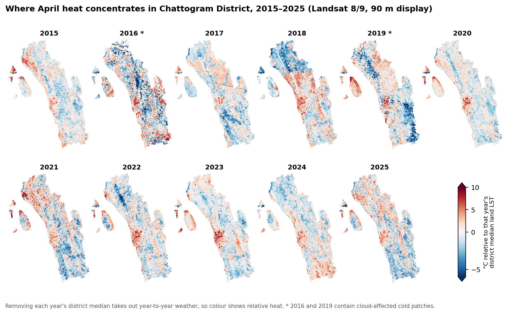
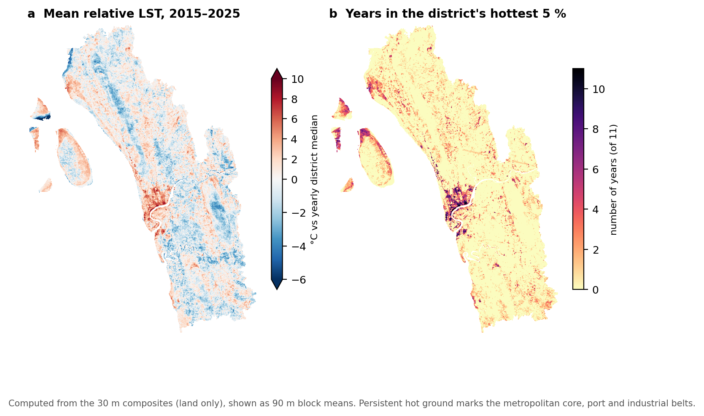
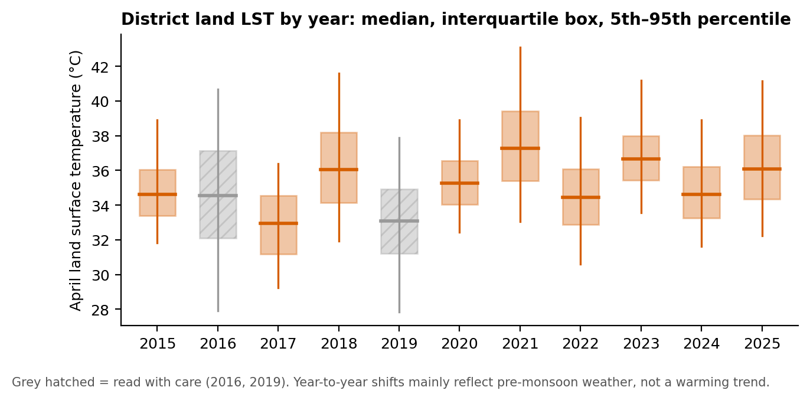

# Chattogram District April Heat Surface, 2015–2025: 3D Land Surface Temperature

**Personal portfolio project (individual work)** · Chinmoy Ghosh Shuvo · 2026

## Summary

An animated 3D surface of April land surface temperature (LST) across Chattogram District for 11 years, built from 91 Landsat 8/9 thermal scenes. Each year is a per-pixel median of clear scenes at 30 m. In the animation, colour shows temperature and height shows how far each place sits above that year's district median, so the surface reveals where heat concentrates rather than how hot the year was. The Chattogram metropolitan core along the Karnaphuli, the port/EPZ belt and the airport stand out as the hottest ground every year. The forested Sitakunda hills and the eastern hill belt are consistently the coolest. The district median ranged from **33.0 °C (2017)** to **37.3 °C (2021)** with no clear direction: the swings mainly reflect pre-monsoon weather, not a warming trend.

*Preview. Full 28-second video: [`images/chattogram-lst-3d-2015-2025.mp4`](images/chattogram-lst-3d-2015-2025.mp4). Side panels track the district median LST and the April urban heat island intensity (SUHII, MODIS) from my Chattogram–Karachi conference study.*

## Study area

**Chattogram District, Bangladesh**: 4,432 km² in 12 parts, including Sandwip and the smaller islands (WGS 84 / UTM 46N).

## Data

| Dataset | Use | Resolution |
|---|---|---|
| Landsat 8/9 Collection 2 Level-2 (ST_B10, QA_PIXEL) via Microsoft Planetary Computer STAC | Land surface temperature and cloud masking | 30 m |
| 91 scenes, mostly WRS-2 path 136 rows 44–45, a few from paths 135 and 137 | Yearly composites, 2015–2025 | — |
| OCHA/BBS Common Operational Dataset, ADM2 (P-code BD2015) | District boundary | Vector |

## Method

1. **Temperature:** ST_B10 converted to °C with the USGS scale factors (LST = DN × 0.00341802 + 149.0 − 273.15).
2. **Masking:** removed fill, dilated cloud, cirrus, cloud, cloud shadow and snow (CFMask). A cloud-remnant filter also removed land pixels more than 7 °C colder than that scene's land median, a threshold set above the normal forest-versus-city contrast.
3. **Yearly composites:** every scene was warped to one shared 30 m grid and the per-pixel median taken. April was the target window. If April covered less than 95% of the district, the window widened to 15 Mar–15 May, then to 1 Mar–31 May.
4. **Statistics:** land pixels only (water flagged in the QA band is excluded).
5. **Display layer (animation only):** 90 m block means, gap filling (GDAL FillNodata) and replacement of cold outliers. Height = LST minus the year's district median, lightly smoothed (3 × 3 blocks). Places warmer than the median are exaggerated (difference^1.3, 380 m per unit) and cooler places are flattened (× 0.3), so hotspots rise as spikes. Frames between years are blended for visual continuity only; they are not data.
6. **Rendering:** QGIS 4.2 3D with the height raster as terrain and the colour raster draped on it, exported frame by frame at 1920 × 1080 and encoded with FFmpeg.

## Results

| Year | Window | Scenes | Coverage | Median (°C) | Mean (°C) | 95th pct (°C) | 95th − median |
|---|---|---|---|---|---|---|---|
| 2015 | 15 Mar–15 May | 10 | 100% | 34.6 | 34.9 | 38.9 | 4.3 |
| 2016 | 1 Mar–31 May | 8 | 89% | 34.5 | 34.5 | 40.7 | 6.1 |
| 2017 | 15 Mar–15 May | 8 | 100% | **33.0** | 32.9 | 36.4 | 3.4 |
| 2018 | April | 4 | 99% | 36.0 | 36.3 | 41.6 | 5.5 |
| 2019 | 1 Mar–31 May | 13 | 97% | 33.1 | 33.0 | 37.9 | 4.8 |
| 2020 | 15 Mar–15 May | 7 | 100% | 35.3 | 35.4 | 38.9 | 3.7 |
| 2021 | 15 Mar–15 May | 7 | 97% | **37.3** | 37.6 | 43.1 | 5.8 |
| 2022 | 15 Mar–15 May | 12 | 100% | 34.5 | 34.6 | 39.1 | 4.6 |
| 2023 | April | 7 | 100% | 36.7 | 36.9 | 41.2 | 4.6 |
| 2024 | April | 9 | 99% | 34.6 | 34.8 | 38.9 | 4.3 |
| 2025 | April | 6 | 100% | 36.1 | 36.3 | 41.2 | 5.1 |

*Land pixels only. Source: `viz/data/composite_summary.json`.*

- **Persistent hotspots:** the metropolitan core, the port/EPZ belt and the airport are the hottest ground in every year.
- **No trend:** the 4.3 °C spread in the district median has no consistent direction and mostly reflects rain, soil moisture and haze around each overpass.
- **Hot years have more extreme hotspots:** the gap between the hottest 5% of land and the median is widest in 2016, 2021 and 2018 (5.5–6.1 °C) and narrowest in 2017 and 2020 (3.4–3.7 °C).

**Caveats:** 2016 (89% coverage) and 2019 still contain cloud-affected cold patches, and some years show faint seams where scenes from different dates meet. Each year is a multi-date composite, sometimes including March or May. LST is the temperature of the ground surface, not the air.

## Code

- [`code/build_april_lst.py`](code/build_april_lst.py): searches the Planetary Computer STAC, downloads the scenes, masks them and builds the yearly 30 m composites. Requires GDAL.
- [`code/render/render_spiky_fixed_angle.py`](code/render/render_spiky_fixed_angle.py): builds the spiky height and colour rasters and renders the 3D frames inside QGIS from a fixed camera angle.
- [`viz/make_figures.py`](viz/make_figures.py): builds the three analysis figures above from the 30 m GeoTIFFs and writes `viz/data/yearly_land_stats.csv`.

Set the `OUT` / `D` folder paths at the top of each script to your own project folder before running.

## Tools

QGIS 4.2 (3D view, PyQGIS) · Python (GDAL, NumPy, rasterio, matplotlib) · Microsoft Planetary Computer STAC API · FFmpeg

## Contact

Chinmoy Ghosh Shuvo · Open to collaboration and knowledge sharing. Feel free to reach out on [LinkedIn](https://www.linkedin.com/in/chinmoyghosh034).

## References

USGS Landsat 8-9 Collection 2 Level-2 Science Product Guide · Cook et al. (2014) *Remote Sensing* 6:11244–11266 · Malakar et al. (2018) *IEEE TGRS* 56:5717–5735 · Foga et al. (2017) *Remote Sensing of Environment* 194:379–390 · Microsoft Planetary Computer (Source et al. 2022) · OCHA & BBS COD-AB (Humanitarian Data Exchange) · QGIS Development Team (2026). The full notes are in [`report/`](report/).
